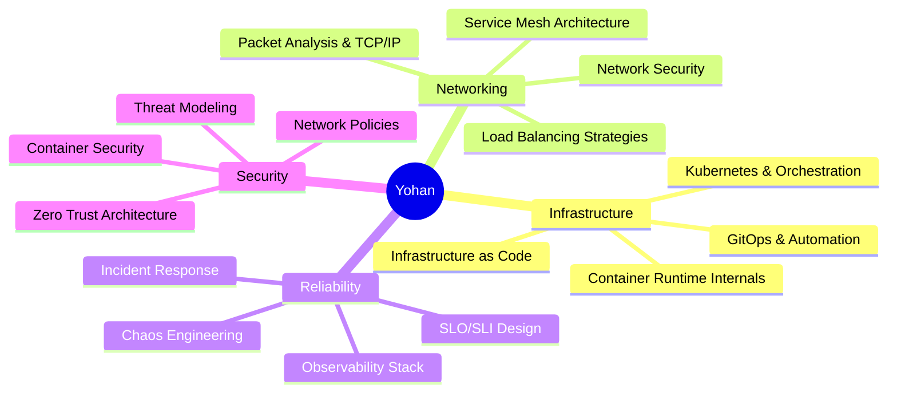
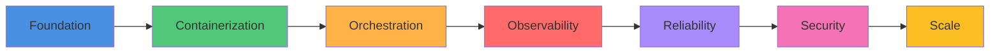

<div align="center">

# 👋 Hey, I'm Yohan Senadheera

### Computer Engineering Undergraduate • SRE Enthusiast • Infrastructure Engineer

[](https://yohan-senadheera.pages.dev/)
[](https://www.linkedin.com/in/yohan-senadheera/)
[](mailto:your.email@example.com)

```ascii
┌─────────────────────────────────────────────────────────────┐
│  "If it can fail, it should be observed.                    │
│   If it fails, recovery should be clear."                   │
└─────────────────────────────────────────────────────────────┘
```

</div>

---

## 🎯 About Me

I'm an engineer who **thrives in the chaos between development and production**.

Not just writing code — but **deploying, monitoring, breaking, fixing, and hardening systems** until they're bulletproof.

I'm fascinated by what happens *after* `git push`:

<table>
<tr>
<td width="50%">

**🔥 When things break:**
- Containers won't start
- Networks partition
- Latency spikes to infinity
- Cascading failures ripple through
- Recovery mechanisms kick in

</td>
<td width="50%">

**✨ That's where I thrive:**
- Debugging distributed systems
- Building observability pipelines
- Designing failure recovery
- Automating incident response
- Making chaos engineering productive

</td>
</tr>
</table>

> **Real engineering** begins when production breaks at 3 AM and you need to understand *why*.

---

## 🧠 What Drives Me



---

## ⚙️ Technical Obsessions

<details open>
<summary><b>🌐 Networking & Protocols</b></summary>

- Deep packet inspection and traffic analysis
- DNS, TCP/IP, HTTP/2, gRPC internals
- Service mesh behavior (Istio, Linkerd)
- Network failure scenarios and resilience
- Private 5G and edge computing architecture

</details>

<details open>
<summary><b>☁️ Cloud Native & Kubernetes</b></summary>

- Multi-cluster orchestration patterns
- Custom controllers and operators
- Pod scheduling and resource optimization
- StatefulSets, PVCs, and storage classes
- Helm charts and GitOps workflows

</details>

<details open>
<summary><b>📊 Observability & SRE</b></summary>

- Prometheus metrics and PromQL mastery
- Grafana dashboard engineering
- Distributed tracing (Jaeger, Tempo)
- Log aggregation (ELK, Loki)
- SLI/SLO definition and alerting

</details>

<details open>
<summary><b>🔐 Security & Resilience</b></summary>

- Container security scanning and hardening
- Network policy enforcement
- Secret management (Vault, Sealed Secrets)
- Chaos engineering with Chaos Mesh
- Disaster recovery and backup strategies

</details>

---

## 🛠️ My Engineering Philosophy

```yaml
approach:
  design:
    - Start minimal but production-realistic
    - Design for failure from day one
    - Document architecture decisions
  
  build:
    - Containerize everything
    - Version control infrastructure
    - Automate repetitive tasks
  
  deploy:
    - Use GitOps workflows
    - Implement gradual rollouts
    - Maintain rollback procedures
  
  observe:
    - Instrument with metrics
    - Build meaningful dashboards
    - Set up intelligent alerts
  
  chaos:
    - Inject controlled failures
    - Measure recovery time
    - Verify alert accuracy
  
  learn:
    - Document post-mortems
    - Create runbooks
    - Share knowledge

philosophy: |
  "The best way to understand a system is to watch it fail 
   and observe how it recovers."
```

---

## 💻 Tech Stack

### **Core Infrastructure**

<p align="center">
  
</p>

### **Observability & Monitoring**

<p align="center">
  
</p>

### **Development & Automation**

<p align="center">
  
</p>

### **Databases & Storage**

<p align="center">
  
</p>

### **Web & Frontend**

<p align="center">
  
</p>

---

## 📊 Current Focus Areas

<table>
<tr>
<td width="33%" align="center">

### 🎯 Q1 2026

**Kubernetes Mastery**

- CKA certification prep
- Custom operators
- Advanced scheduling
- Multi-tenancy patterns

</td>
<td width="33%" align="center">

### 📈 Observability

**Production Monitoring**

- PromQL deep dive
- Alert tuning
- SLO implementation
- Distributed tracing

</td>
<td width="33%" align="center">

### 🔐 Security

**Infrastructure Hardening**

- Zero-trust networking
- Supply chain security
- Runtime protection
- Compliance automation

</td>
</tr>
</table>

---

## 🚀 Featured Projects

<details>
<summary><b>🎪 Kubernetes Chaos Lab</b> - Production-grade chaos engineering platform</summary>

**Tech:** Kubernetes • Chaos Mesh • Prometheus • Grafana • Python

- Built automated failure injection framework
- Implemented network latency/partition scenarios
- Created custom metrics for MTTR tracking
- Developed runbook automation system

**Key Learning:** Understanding how to design systems that gracefully degrade under failure

</details>

<details>
<summary><b>☁️ Multi-Cloud Deployment Pipeline</b> - GitOps-driven infrastructure automation</summary>

**Tech:** Terraform • ArgoCD • GitHub Actions • AWS/GCP

- Infrastructure as Code for 3-tier applications
- Automated multi-region deployments
- Blue-green deployment strategies
- Cost optimization with auto-scaling

**Key Learning:** How to make infrastructure changes as safe as code changes

</details>

<details>
<summary><b>📊 Observability Stack from Scratch</b> - Full monitoring solution</summary>

**Tech:** Prometheus • Grafana • Loki • Jaeger • Alertmanager

- Custom exporter development
- SLI/SLO dashboard engineering
- Log correlation with traces
- Intelligent alert routing

**Key Learning:** You can't improve what you can't measure

</details>

<details>
<summary><b>🌐 Private 5G Core Network</b> - Edge computing infrastructure</summary>

**Tech:** Open5GS • Kubernetes • Ansible • SDN

- Deployed containerized 5G core
- Network slicing implementation
- Edge node orchestration
- Performance benchmarking

**Key Learning:** How modern networks blur the line between software and hardware

</details>

<details>
<summary><b>🔒 Zero-Trust Kubernetes Platform</b> - Security-first cluster design</summary>

**Tech:** Istio • OPA • Falco • cert-manager • Vault

- mTLS for all service communication
- Policy-based access control
- Runtime threat detection
- Automated certificate rotation

**Key Learning:** Security isn't a feature, it's a foundation

</details>

---

## 📈 GitHub Stats

<div align="center">


</div>

<div align="center">

[](https://git.io/streak-stats)

</div>

---

## 🎓 Learning Path



**Current Stage:** Deepening **Reliability** & **Security** while scaling complexity

---

## 💡 Engineering Principles

<table>
<tr>
<td>

### 🎯 **Systems Thinking**

- Everything is interconnected
- Understand upstream & downstream
- Optimize for the whole, not parts

</td>
<td>

### 📊 **Data-Driven**

- Measure everything that matters
- Make decisions from evidence
- Validate assumptions with metrics

</td>
</tr>
<tr>
<td>

### 🔄 **Iterative Improvement**

- Ship small, ship often
- Learn from production
- Continuously refactor

</td>
<td>

### 🧪 **Chaos as Learning**

- Break things intentionally
- Document failure modes
- Automate recovery

</td>
</tr>
</table>

---

## 🎯 2026 Goals

- [ ] **Kubernetes Certified Administrator (CKA)**
- [ ] **Build production SRE platform** (open source)
- [ ] **Contribute to CNCF projects** (Prometheus, Kubernetes)
- [ ] **Publish technical blog series** on observability
- [ ] **Implement GitOps at scale** for multi-cluster environments
- [ ] **Master eBPF** for advanced networking and security

---

## 📚 Currently Reading

| Topic | Resource | Status |
|-------|----------|--------|
| SRE | *Site Reliability Engineering* (Google) | 📖 In Progress |
| Kubernetes | *Kubernetes Patterns* (Ibryam & Huss) | ✅ Completed |
| Networking | *TCP/IP Illustrated Vol. 1* | 📖 In Progress |
| Observability | *Distributed Tracing in Practice* | 📋 Queued |

---

## 🔗 Let's Connect

<div align="center">

**Interested in systems engineering, reliability, or infrastructure?**

[](https://yohan-senadheera.pages.dev/)
[](https://www.linkedin.com/in/yohan-senadheera/)
[](mailto:your.email@example.com)

### 💬 Open to discussing:
**Infrastructure Design** • **Kubernetes Architecture** • **Observability Strategies** • **Chaos Engineering** • **SRE Practices**

</div>

---

<div align="center">

### 🎯 **Philosophy**

```
┌──────────────────────────────────────────────────────────────┐
│                                                              │
│  "I don't aim to know everything.                           │
│   I aim to ask the right questions,                         │
│   build real systems,                                       │
│   observe them carefully,                                   │
│   and improve them deliberately."                           │
│                                                              │
│  That's how engineers are forged.                           │
│                                                              │
└──────────────────────────────────────────────────────────────┘
```

<br>

**✨ Built with curiosity • Improved through failure • Hardened by production ✨**

<br>


---

*Last updated: February 2026*

</div>
