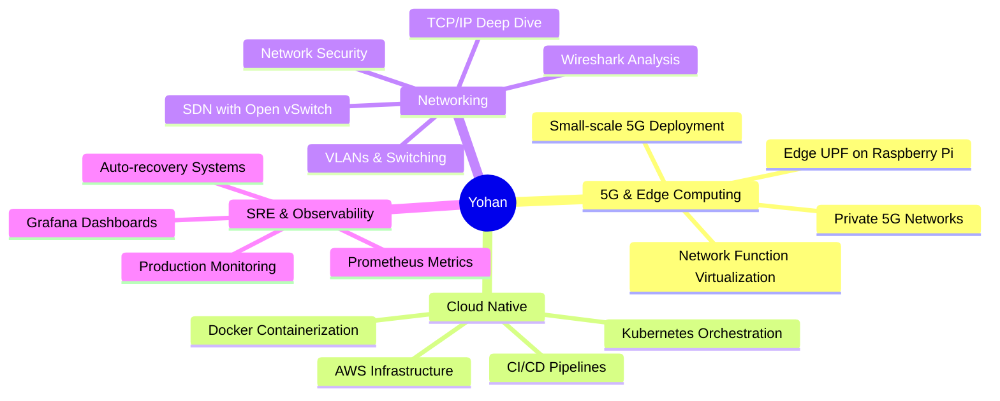
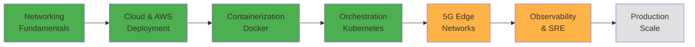

<div align="center">

# 👋 Hey, I'm Yohan Senadheera

### Computer Engineering @ University of Peradeniya | 5G • Cloud Native • SRE

[](https://yohan-senadheera.pages.dev/)
[](https://www.linkedin.com/in/yohan-senadheera/)
[](mailto:yohansenadheera@gmail.com)
[](https://github.com/Yohan-Senadheera)

```ascii
┌─────────────────────────────────────────────────────────────┐
│  "If it can fail, it should be observed.                    │
│   If it fails, recovery should be clear."                   │
└─────────────────────────────────────────────────────────────┘
```

</div>

---

## 🎯 About Me

I'm a **Computer Engineering undergraduate** building real-world infrastructure — from **5G edge networks** to **cloud-native platforms**.

My focus? **What happens after deployment:**

<table>
<tr>
<td width="50%">

**🔥 The Reality:**
- 5G UPF running on Raspberry Pi at the edge
- Kubernetes clusters auto-recovering from failures
- Real-time dashboards tracking production bottlenecks
- Network packets revealing protocol behavior
- Systems breaking (intentionally) to learn resilience

</td>
<td width="50%">

**✨ My Approach:**
- Deploy containerized workloads on K8s
- Build observability with Prometheus & Grafana
- Implement CI/CD pipelines on AWS
- Optimize network traffic with SDN
- Debug distributed systems in production

</td>
</tr>
</table>

> Currently working with **SLTMobitel** on private 5G infrastructure while building cloud-native platforms with **automatic recovery mechanisms**.

---

## 🧠 What Drives Me



---

## 🚀 Featured Projects

### 🌐 **Private 5G Network Implementation** (Current - SLTMobitel Collaboration)
*August 2025 - Present*

Building production-ready 5G infrastructure with edge computing capabilities.

**My Focus:** Edge UPF optimization on Raspberry Pi for small-scale 5G deployment

**Tech Stack:** `Raspberry Pi` `Kubernetes` `SDN` `Open vSwitch` `Wireshark` `tcpdump`

**Key Achievements:**
- Implemented edge User Plane Function for optimized 5G traffic routing
- Reduced latency through strategic edge placement
- Collaborated on RAN virtualization and core server optimization
- Hands-on network packet analysis and protocol debugging

---

### ☁️ **Mini 5G Edge Network Testbed** (Individual Project)
*January 2026 - Present*

Production-grade testbed combining 5G networking with cloud-native deployment.

**Tech Stack:** `Kubernetes` `AWS` `Docker` `CI/CD` `Network Functions` `Real-time Monitoring`

**Implementation:**
- Containerized 5G network functions for flexible deployment
- Automated CI/CD pipeline for rapid iteration
- Deployed on Kubernetes with AWS backend
- Real-time network monitoring dashboard
- Edge computing capabilities with distributed architecture

---

### 📊 **Cloud-Native Platform with K8s Observability**
*February 2026*

Kubernetes platform demonstrating SRE principles and production resilience.

**Tech Stack:** `Kubernetes` `Docker` `Prometheus` `Grafana` `Linux`

**SRE Implementation:**
- Containerized API and database with orchestration
- Automatic failure detection and recovery mechanisms
- Complete observability stack with Prometheus metrics
- Grafana dashboards for system health visualization
- Self-healing infrastructure patterns

---

### 🤖 **P-E-BO Desk Companion** (Award-Winning)
*December 2024 - July 2025*

**🏆 IESL UIY Top 10 Finalist | 3rd Place ICIIS 2025**

AI-powered desk companion with emotion detection and voice interaction.

**My Role:** Mobile app development, cloud deployment, project website

**Tech Stack:** `React Native` `Firebase` `AWS` `Gemini AI` `IoT Sensors` `Raspberry Pi`

**Achievements:**
- Built cross-platform mobile app with Firebase backend
- Deployed AI services on AWS infrastructure
- 7-emotion detection with 95% accuracy
- Gemini AI integration for natural voice interaction
- Developed project website and demo materials

**Awards:**
- 🥉 3rd Place - I-To-I Competition, ICIIS 2025
- 🎯 Top 10 Finalist - IESL Undergraduate Inventor of the Year
- 🎪 Featured at Techno 2025 Exhibition

---

### 🎓 **Personalized AI Feedback System** (Final Year Project)
*August 2024 - Present*

Adaptive learning platform with AI-driven personalized feedback.

**My Role:** AI module implementation, virtual teaching assistant development

**Tech Stack:** `Python` `Node.js` `GPT-3.5` `Moodle Integration`

**Implementation:**
- Built intelligent feedback generation system
- Developed virtual teaching assistant for student queries
- Integrated with existing LMS (Moodle)
- Collaborated on data processing and model training pipeline

---

### 🏭 **MONA Dashboard** (Second Year Project)
*April 2024 - October 2024*

Real-time production monitoring system for manufacturing optimization.

**My Role:** Production rate tracking module development

**Tech Stack:** `MongoDB` `JavaScript` `React.js` `Python` `SCSS` `HTML/CSS`

**Features:**
- Real-time machine monitoring interface
- Production bottleneck detection algorithms
- Process optimization metrics
- Performance visualization dashboards

---

## 💻 Tech Stack

### **Core Infrastructure**

<p align="center">
  
</p>

### **Observability & Monitoring**

<p align="center">
  
</p>

### **Development & Automation**

<p align="center">
  
</p>

### **Databases & Storage**

<p align="center">
  
</p>

### **Web & Frontend**

<p align="center">
  
</p>

---

## 👨‍🏫 Teaching & Leadership

### **Casual Instructor** - University of Peradeniya
*November 2024 - August 2025*

Department of Computer Engineering

- Teaching **Database Systems** and **Programming Methodology**
- Conducted lab sessions for 40+ students
- Mentored students on C programming and SQL fundamentals
- Developed teaching materials and practical exercises

---

### **Team Captain** - Shooting Sports Association
*July 2023 - October 2025*

University of Peradeniya

**Founded and led the air gun shooting program**

- Initiated air gun shooting sport at the university
- Led team to **championship** at 2024 Inter-University Air Rifle Competition
- **🏆 15 Shots Men's Team Championship - 2024 Invitational**
- Developed training programs and competition strategies

---

### **Editor** - Hackers' Club
*August 2025 - Present*

University of Peradeniya

- Managing technical content for 200+ member community
- Coordinating technical events and workshops
- Leading club communications and media strategy

---

### **AIESEC Leadership Roles**
*February 2022 - November 2024*

AIESEC in Kandy - University of Peradeniya

**Held multiple leadership positions:**
- **Brand Manager** - Marketing strategy and campaigns
- **OC Vice President** - Cross-functional team coordination
- **Team Leader** - International exchange program management
- **🏆 Best Event Marketer** - February 2024

Managed marketing campaigns and coordinated international exchange programs across diverse teams.

---

## 🎓 Education & Certifications

### **B.Sc. Eng (Hons) in Computer Engineering**
**University of Peradeniya** | *February 2022 - Present*

**Relevant Coursework:**
- Advanced Communication Networks (SDN, Docker)
- Network Security
- Database Systems
- Software Architecture

---

### **CCNA (Cisco Certified Network Associate)**
**Cisco Networking Academy** | *August 2025 - Present*

**Networking Fundamentals:**
- TCP/IP, Subnetting, Switching, VLANs, Routing
- Network Security & Optimization
- STP, EtherChannel Configuration

---

### **Completed Certifications**

| Certification | Platform | Date |
|---------------|----------|------|
| 📜 AWS Technical Essentials | AWS (Coursera) | January 2026 |
| 📜 5G for Everyone | Qualcomm (Coursera) | September 2025 |
| 📜 Hands-on Linux Commands & Shell Scripting | IBM (Coursera) | May 2025 |

### **In Progress**

- 🔄 Docker / Kubernetes for Beginners - KodeKloud
- 🔄 CCNA 1 & 2 - Cisco Networking Academy

---

### **Academic Excellence**

**GCE Advanced Level (2020)**
- Combined Mathematics: **A**
- Physics: **A**
- Chemistry: **A**
- General English: **A**

**GCE Ordinary Level (2020)**
- **9 A's** - Awarded for School Best Results
- Nalanda College, Colombo

---

## 🏆 Awards & Recognition

### **Engineering & Innovation**

| Award | Event | Year |
|-------|-------|------|
| 🥇 **Top 10 Finalist** | IESL Undergraduate Inventor of the Year (P-E-BO) | 2025 |
| 🥉 **3rd Place** | I-To-I Competition, ICIIS 2025 (P-E-BO) | 2025 |
| 🎪 **Featured Exhibit** | Techno 2025 | 2025 |

### **Competitive Programming**

| Place | Competition | Organizer | Year |
|-------|-------------|-----------|------|
| 🏅 **27th Place** | MoraExtreme 9.0 | IEEE SB University of Moratuwa | 2024 |
| 🏅 **9th Place** | Coders V11.0 | ACES - University of Peradeniya | 2024 |

### **Sports Excellence**

| Award | Competition | Year |
|-------|-------------|------|
| 🎯 **Team Championship** | 15 Shots Men's Team - Air Rifle | 2024 |
| 🎯 **Magam Shooting Sports Colours Insignia** | Inter-University Championship | 2024 |

### **Leadership & Marketing**

| Recognition | Organization | Year |
|-------------|--------------|------|
| 🎖️ **Best Event Marketer** | AIESEC in University of Peradeniya | 2024 |

---

## 💻 Tech Stack

### **DevOps & Cloud**
<p align="left">
  
</p>

`Docker` `Kubernetes` `AWS (EC2, S3)` `Linux` `Git` `CI/CD Pipelines` `Bash Scripting`

### **Networking**
<p align="left">
  
</p>

`TCP/IP` `VLANs` `Switching` `Routing` `SDN` `5G Networks` `Wireshark` `Network Security` `Open vSwitch` `STP` `EtherChannel`

### **Programming & Development**
<p align="left">
  
</p>

`Python` `JavaScript` `React` `React Native` `Node.js` `HTML/CSS`

### **Databases & Monitoring**
<p align="left">
  
</p>

`SQL` `MongoDB` `Firebase` `Prometheus` `Grafana`

---

## 📊 Current Focus (2026)

<table>
<tr>
<td width="33%" align="center">

### 🌐 **5G & Edge**

**SLTMobitel Collaboration**

- Private 5G deployment
- Edge UPF optimization
- Network function virtualization
- Small-scale production systems

</td>
<td width="33%" align="center">

### ☁️ **Cloud Native**

**Platform Engineering**

- Kubernetes deep dive
- Auto-recovery patterns
- Observability stacks
- CI/CD automation

</td>
<td width="33%" align="center">

### 📡 **Networking**

**CCNA & Beyond**

- Protocol fundamentals
- SDN with Open vSwitch
- Network security
- Traffic analysis

</td>
</tr>
</table>

---

## 🎯 2026 Roadmap

### **Q1 2026** ✅
- [x] Complete Mini 5G Edge Network Testbed
- [x] Build Cloud-Native Platform with K8s Observability
- [x] AWS Technical Essentials Certification
- [ ] CCNA Certification (In Progress)

### **Q2-Q3 2026** 🔄
- [ ] **Complete Private 5G Network** with SLTMobitel
- [ ] **CKA (Certified Kubernetes Administrator)**
- [ ] **Contribute to open-source** networking/K8s projects
- [ ] **Build production-grade SRE platform** with full observability

### **Q4 2026** 🎯
- [ ] **Launch technical blog** on 5G/K8s/SRE topics
- [ ] **Scale 5G testbed** to multi-node deployment
- [ ] **Advanced networking certification** (CCNP or equivalent)
- [ ] **Graduate project completion** - AI feedback system

---

## 📚 Learning Journey



**✅ Completed** | **🔄 In Progress** | **⏳ Planned**

---

## 💡 Engineering Philosophy

```yaml
approach:
  
  learn_by_building:
    - "Don't just read about 5G — deploy it on a Pi"
    - "Don't just study K8s — break it and fix it"
    - "Don't just learn networking — capture and analyze packets"
  
  production_mindset:
    - "If it can't recover automatically, it's not ready"
    - "If you can't observe it, you can't improve it"
    - "If it works only on your laptop, it doesn't work"
  
  collaborate_and_teach:
    - "Teaching 40+ students deepened my own understanding"
    - "Team projects revealed gaps in solo learning"
    - "Leading a shooting team taught me systematic training"

philosophy: |
  "Build small, real systems.
   Observe them carefully.
   Improve them deliberately.
   Share what you learn."
```

---

## 📈 GitHub Stats

<div align="center">


</div>

<div align="center">

[](https://git.io/streak-stats)

</div>

---

## 🔗 Let's Connect

<div align="center">

**Interested in 5G networks, cloud-native systems, or SRE?**

[](https://yohan-senadheera.pages.dev/)
[](https://www.linkedin.com/in/yohan-senadheera/)
[](mailto:yohansenadheera@gmail.com)

### 💬 Open to discussing:
**5G & Edge Computing** • **Kubernetes & Container Orchestration** • **Network Engineering** • **SRE Practices** • **AWS & Cloud Infrastructure**

### 🎯 Seeking:
**SRE Internships** • **DevOps Roles** • **Network Engineering** • **Software Engineering** • **Cloud Infrastructure**

</div>

---

<div align="center">

### 🎯 **Philosophy**

```
┌──────────────────────────────────────────────────────────────┐
│                                                              │
│  From 5G networks on Raspberry Pi                           │
│  to Kubernetes clusters in the cloud,                       │
│  from teaching 40 students                                  │
│  to leading championship shooting teams —                   │
│                                                              │
│  I learn by building real systems,                          │
│  observing them under pressure,                             │
│  and improving them deliberately.                           │
│                                                              │
│  That's how engineers grow.                                 │
│                                                              │
└──────────────────────────────────────────────────────────────┘
```

<br>

**✨ Built with curiosity • Improved through failure • Deployed in production ✨**

<br>


---

*Last updated: February 2026*

</div>
